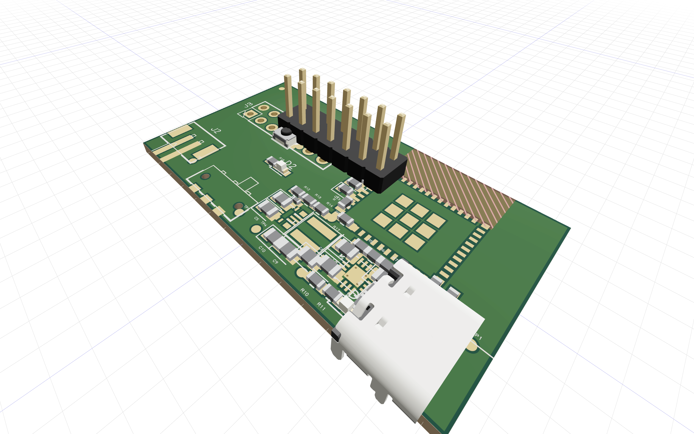

# tscircuit   playground
A small repo where I play around and see, if tscircuit is valid for doing small projects in it...


Okay yeah that seems about right...

## Prerequisites

- Node.js 20 or newer (Node.js 22 is recommended)
- npm 10 or newer

The tscircuit CLI is installed locally with the project, so a global `tsci` installation is not required.

## Get started

```sh
npm install
npm run dev
```

Open <http://localhost:3020> to inspect the live PCB, schematic, and 3D views. Edit `src/board.circuit.tsx`; the preview updates as the file changes.

## Commands

| Command | Purpose |
| --- | --- |
| `npm run dev` | Start the local tscircuit preview server. |
| `npm run typecheck` | Validate the TypeScript/TSX types without emitting files. |
| `npm run check` | Type-check and evaluate the circuit, including tscircuit design checks. |
| `npm run build` | Generate Circuit JSON plus PCB and schematic SVGs in `dist/`. |
| `npm run build:all-images` | Generate all supported preview images. |
| `npm run doctor` | Run tscircuit environment diagnostics. |

For the starter entrypoint, build artifacts are written below `dist/src/board/`.

## Repository layout

```text
.
├── src/
│   └── board.circuit.tsx      # Current board entrypoint
├── docs/
│   └── esp32-board-brief.md   # Decisions needed before schematic capture
├── tscircuit.config.json      # CLI entrypoint configuration
├── tsconfig.json              # Strict TypeScript and tscircuit JSX types
└── AGENTS.md                  # Rules for coding agents working in this repo
```

As the design grows, reusable power, USB, ESP32, and connector sections should move into focused components under `src/components/` while `board.circuit.tsx` remains the top-level assembly.

## ESP32 board workflow

1. Complete the choices in `docs/esp32-board-brief.md`.
2. Select an exact ESP32 module or SoC and record the authoritative datasheet and hardware-design guide.
3. Implement and verify one subsystem at a time: power, ESP32 core, reset/boot, programming/USB, then external I/O.
4. Run `npm run check` after every meaningful change and inspect the schematic and PCB views with `npm run dev`.
5. Before fabrication, independently verify pin mappings, footprints, antenna keep-outs, power integrity, design-rule results, BOM availability, and manufacturer constraints.

## References

- [tscircuit documentation](https://docs.tscircuit.com/)
- [tscircuit CLI quickstart](https://docs.tscircuit.com/intro/quickstart-cli)
- [tscircuit source repository](https://github.com/tscircuit/tscircuit)
